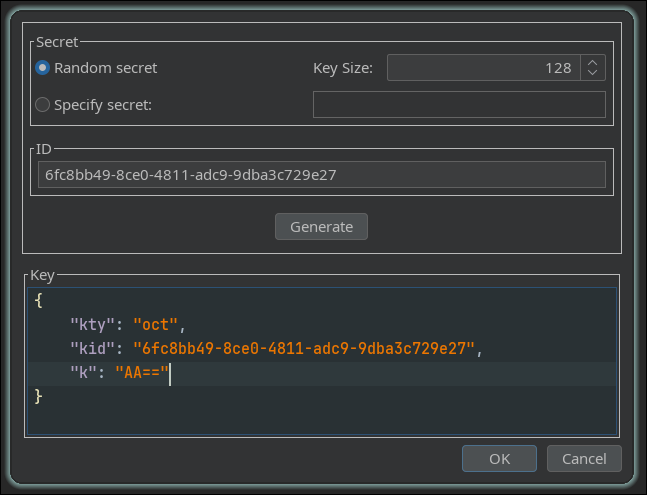
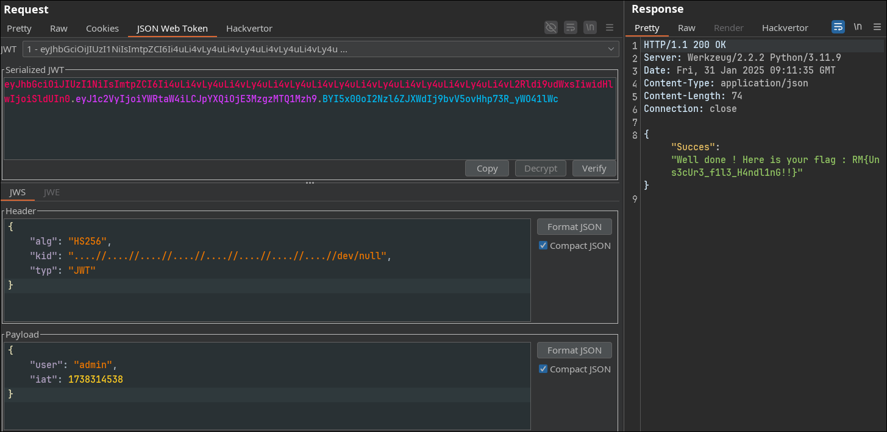

Base on the description, I can inject self-signed JWTs via the kid parameter

Create a new symmetric key with the k value AA== which is base64-encoded null byte

Change the `kid` value and sign with the above key

