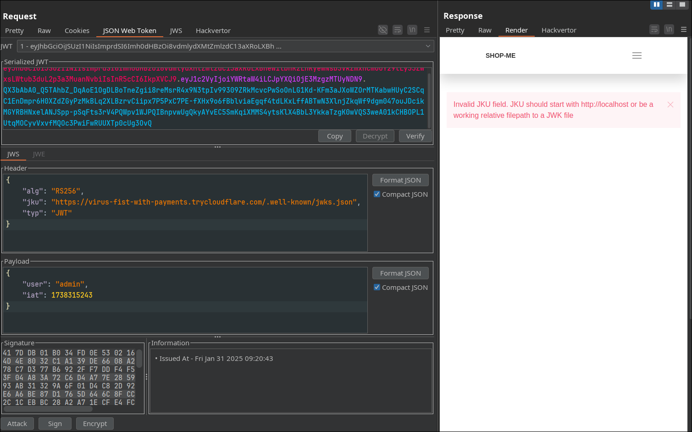

`jku` header injection

First, create a new RSA key and get its public key, example:
```
{
    "kty": "RSA",
    "e": "AQAB",
    "kid": "4d0becde-3b61-4ddc-bbdb-7c506c6d3ca9",
    "n": "n3HBe-VJzK6-U1VqxVr00MFGgIw1l8pjnAsPLLAFiN6FVgLqnmmSfZPVyosfjCYm_a6oOWWUpp8n9K22Qc6GolAUPcmIP8poRvUiMiAxbAN62POSJPprLdiYLj1tiHnr6RYa8yIC4xN5ywNauBZQBwlqYHQNAtOqI3AsQrTCGxeovMxfsoZFHK6hjuJB1uIv0FPQWyGvFstC-BmwXJvmeeGG_dUMXk-ra8ovq6nNWslDYgTZp60FIyRSI-9oubC5SBMLyNPVqFZa-x4_3n7GNwEkI6gf3j29sl_svSOGtNfith--oHeqCFVF-vYSXVa5yoReEduaZ07QWE9pSz5UDw"
}
```


Change jku value, match the kid value and sign with the new key



Too bad it doesnt accept my url, own enough money to buy a domain, thats probaly why this challenge only got  768 	solve